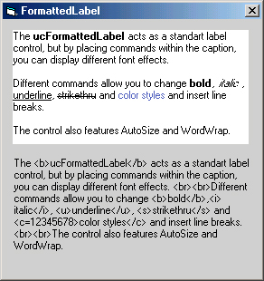



## Formatted Label

### Description

The FormattedLabel acts as a standart label control, but by placing commands within the caption, you can display different font effects.

Different commands allow you to change bold, italic, underline, strikethru and color styles and insert line breaks.

The control also features AutoSize and WordWrap.

But i can't do it with transparent background. Buuuu. :o)

Hi folks. I change tags to html like but without color tag. In declaration part of UserControl there is constants like

CONST cBoldStart = "<something>".

You can change tags there but they must by among < and >. Thanks to all for your reqest and tips.

p.s. I hope than my programing is better then my english. Sorry :o))))
 
### More Info
 

             |
---                |---
**Submitted On**   |2002-05-08 15:11:26
**By**             |[RadimS](https://github.com/Planet-Source-Code/PSCIndex/blob/master/ByAuthor/radims.md)
**Level**          |Intermediate
**User Rating**    |4.9 (69 globes from 14 users)
**Compatibility**  |VB 6\.0
**Category**       |[Custom Controls/ Forms/  Menus](https://github.com/Planet-Source-Code/PSCIndex/blob/master/ByCategory/custom-controls-forms-menus__1-4.md)
**World**          |[Visual Basic](https://github.com/Planet-Source-Code/PSCIndex/blob/master/ByWorld/visual-basic.md)
**Archive File**   |[Formatted\_80743582002\.zip](https://github.com/Planet-Source-Code/radims-formatted-label__1-34507/archive/master.zip)

